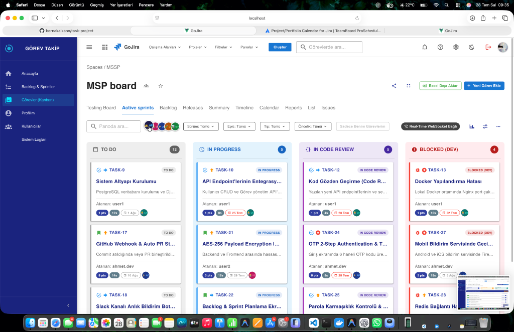
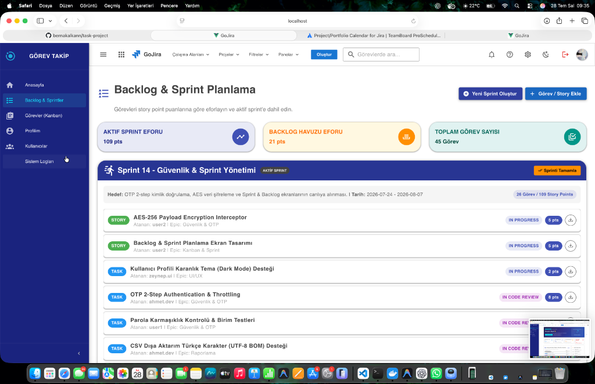
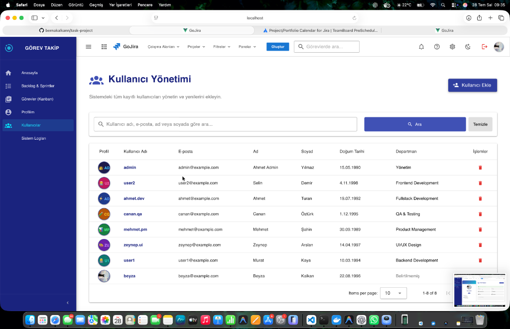
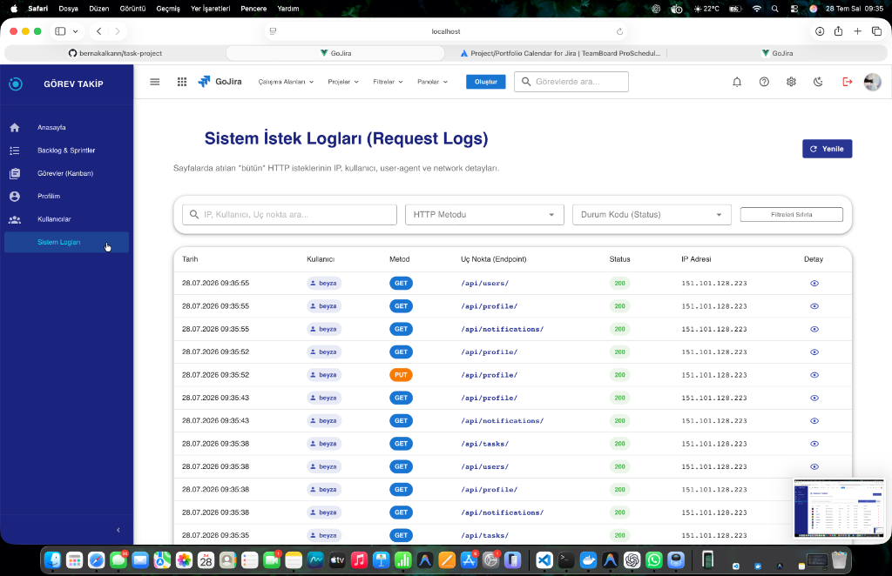
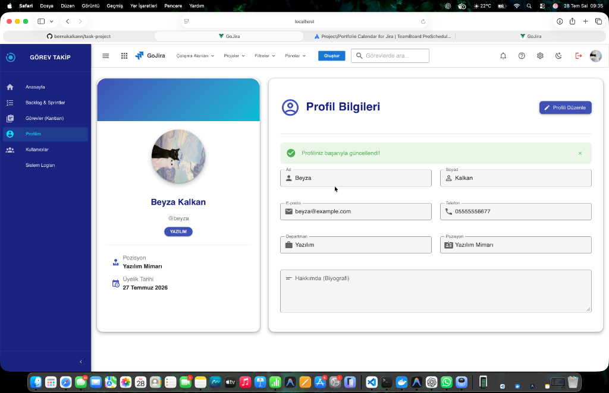
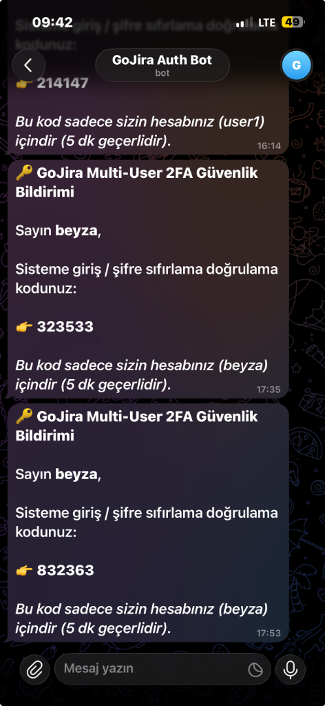
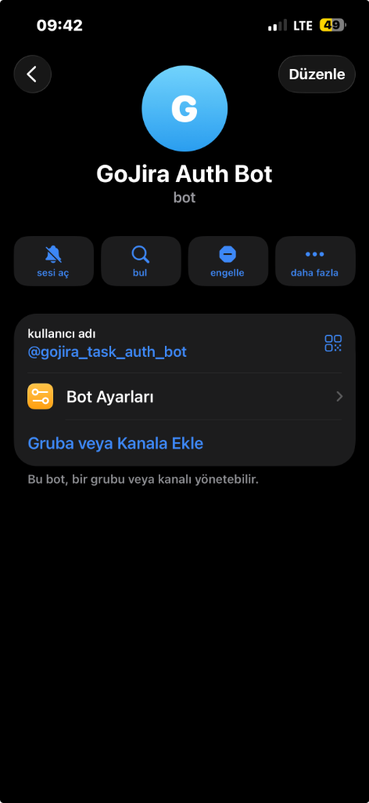

# 🚀 GoJira - Kurumsal Görev Takip ve İşbirliği Platformu

**GoJira**, Jira stili Agile/Scrum süreç yönetimi, canlı WebSocket senkronizasyonu (Redis 7 + Channels), Telegram 2FA güvenlik altyapısı ve gelişmiş kullanıcı/log yönetim paneline sahip kurumsal bir görev takip platformudur.

---

## 🛠️ Kullanılan Teknolojiler (Technology Stack)

| Katman | Teknoloji | Açıklama |
| :--- | :--- | :--- |
| **Backend Framework** | **Django 6 & DRF** | RESTful API, ORM, yetkilendirme ve iş mantığı mimarisi |
| **Real-Time Engine** | **Django Channels & Daphne** | ASGI tabanlı canlı WebSocket iletişim sunucusu |
| **In-Memory & Pub/Sub**| **Redis 7** | WebSocket yayınları için Channel Layer veritabanı |
| **Frontend Framework** | **Vue.js 3 & Vuetify 3** | Reactive SPA arayüz ve Material Design bileşen kütüphanesi |
| **Build Tool** | **Vite** | Yüksek hızlı ön yüz derleme ve paketleme aracı |
| **Ana Veritabanı** | **PostgreSQL 15** | İlişkisel veritabanı yönetim sistemi |
| **Web & Proxy Sunucu** | **Nginx** | Reverse Proxy, SSL termination ve statik dosya sunumu |
| **Konteynerizasyon** | **Docker & Docker Compose** | Multi-container izolasyon ve dağıtım ortamı |
| **2FA Bildirim Botu** | **Telegram Bot API** | Anlık 2FA doğrulama kodu (OTP) iletim servisi |
| **Şifreleme & Güvenlik** | **AES-256 & PBKDF2** | Uçtan uca veri şifreleme ve parola hashleme altyapısı |

---

## 📸 Ekran Görüntüleri ve Modül Detayları

### 📌 1. Görevler Kanban Panosu (Kanban Board & Real-Time Sync)
*Çoklu sütunlu görev panosu, canlı WebSocket senkronizasyon durumu, görev öncelik rozetleri, atanan kullanıcı avatarları ve filtreleme paneli.*


---

### 📌 2. Backlog & Sprint Planlama (`/backlog`)
*Sprint efor puanlamaları (Story Points), aktif sprint yönetimi, "Sprinti Tamamla" / "Başlat" kontrolleri ve Backlog havuzu görev aktarımı.*


---

### 📌 3. Kullanıcı Yönetim Paneli (`/users`)
*Sistemdeki tüm kayıtlı kullanıcıların rolleri, e-posta adresleri, doğum tarihleri, özel profil avatarları ve departman yönetim tablosu.*


---

### 📌 4. Admin Sistem İstek Logları (`/logs`)
*Sistemde atılan tüm HTTP/API isteklerinin IP adresi, kullanıcı adı, HTTP metodu, endpoint ve durum kodu bazında canlı denetim günlüğü (Audit Trail).*


---

### 📌 5. Kullanıcı Profil Sayfası (`/profile`)
*Kullanıcı biyografisi, departman, pozisyon, iletişim bilgileri ve kişiselleştirilmiş avatar yönetim ekranı.*


---

### 📲 6. Telegram Bot 2FA Güvenlik & Bildirim Ekranları (`@gojira_task_auth_bot`)
*Kullanıcı adı bazı eşleştirilen kişisel Telegram hesabına 0.1 saniye içerisinde düşen 6 haneli 2FA OTP doğrulama mesajları ve bot profili.*

| Telegram 2FA OTP Bildirimleri | Telegram Auth Bot Profili |
| :---: | :---: |
|  |  |

---

## 🔑 Varsayılan Giriş Bilgileri

| Rol | Kullanıcı Adı | Şifre | Yetkiler |
| :--- | :--- | :--- | :--- |
| **Sistem Yöneticisi (Admin)** | `beyza` | `Beyza1234!` | Tam Yetkili Admin, Kullanıcı Yönetimi & Telegram 2FA |
| **Admin Yöneticisi** | `admin` | `AdminPassword123!` | Sistem Yönetimi ve Log Ekranı (`/logs`) |
| **Yazılım Geliştirici** | `ahmet.dev` | `User1Password123!` | Görev Panosu, Yorumlar, Subtask'ler |

---

## 🏗️ Docker Container Mimarisi & Hızlı Başlangıç

Projenin tüm servisleri (**PostgreSQL 15**, **Redis 7**, **Django Daphne ASGI Backend**, **Nginx Vue 3 Frontend**) Docker ortamında tek komutla çalışır:

```bash
docker compose up -d --build
```

- 🌐 **Uygulama (Frontend):** [http://localhost](http://localhost)
- ⚙️ **REST API:** [http://localhost/api/](http://localhost/api/)
- 🛡️ **Admin Paneli:** [http://localhost/admin/](http://localhost/admin/)

```text
               +-----------------------------------+
               |     Nginx Container (Port 80)     |
               | (Frontend SPA & Reverse Proxy)    |
               +-----------------+-----------------+
                                 |
              +------------------+------------------+
              |                                     |
    /api/, /ws/ ve /admin/                  Vue Static Files
              |                                     |
              v                                     v
+---------------------------+             +-------------------+
|  Django Daphne ASGI       |             | Single Page App   |
|  Backend (Port 8000)      |             +-------------------+
+------+---------------+----+
       |               |
       v               v
+--------------+ +--------------+
| PostgreSQL   | | Redis 7      |
| DB (Port 5433)| | (Port 6379)  |
+--------------+ +--------------+
```

---

## 🧪 Birim Testler (Unit Tests)

Backend güvenlik ve API birim testlerini çalıştırmak için:

```bash
cd backend
python manage.py test tasks
```
